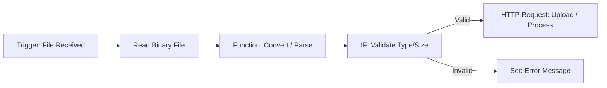

# **Binary File Reader Workflow**

## **What it does**

This workflow reads **binary files** (PDFs, images, CSVs, text files, etc.) from a chosen source, converts them into usable data inside n8n, and then performs custom processing.

Typical use cases:

* Automated extraction of content from uploaded files
* Pre-processing binary documents before API calls
* Converting files into base64 or JSON for later steps
* Handling attachments from webhooks or email triggers
* Moving, analyzing, or parsing binary data in automations

The workflow demonstrates how to:

* Load a binary file
* Access metadata (file name, MIME type, size)
* Convert binary data into text
* Pass the processed data to other nodes

---

## **Nodes included**

* **Webhook / Trigger Node** (to receive or start the workflow)
* **Binary File Node** (e.g., “Read Binary File” or “Move Binary Data”)
* **Function Node** (to convert or manipulate binary → text/base64)
* **Set Node** (for formatting output variables)
* **HTTP Request Node** (optional: send file to an API)
* **IF Node** (optional: validate file type/size)
* **Debug / NoOp Node** (optional for logging)

---

## **How to use**

1. **Open n8n**
   Launch your n8n instance via Cloud, Desktop, or Docker.

2. **Import the workflow JSON**

   * Go to:
     **Workflows → Import from File**
   * Upload the provided `binary-file-reader.json`

3. **Configure file source**
   Depending on your setup, choose one of the following:

   * Webhook Trigger: upload a file via POST request
   * Read Binary File: point to a path on the server
   * Email Trigger: use incoming attachment
   * HTTP Request: pull a file from a URL

4. **(Optional) Add API credentials**
   If you send the file to an external API, configure your credentials under:
   **Credentials → Create New**

5. **Activate workflow**
   Turn the workflow **ON** to start processing incoming files automatically.

---

## **Flow Diagram**

*(Optional — include a diagram or screenshot)*

Example Mermaid diagram:

---

## **Notes**

* The workflow supports any file type that n8n can ingest as binary data.
* To convert binary → text, ensure the node uses the correct encoding (`utf8`, `base64`, etc.).
* If the workflow expects large files, enable **“Allow Large Files”** in the Binary Data settings.
* For cloud-based automations, ensure your hosting environment allows file uploads.
* Some APIs require the file buffer format; you can convert the binary data accordingly using a Function node.

